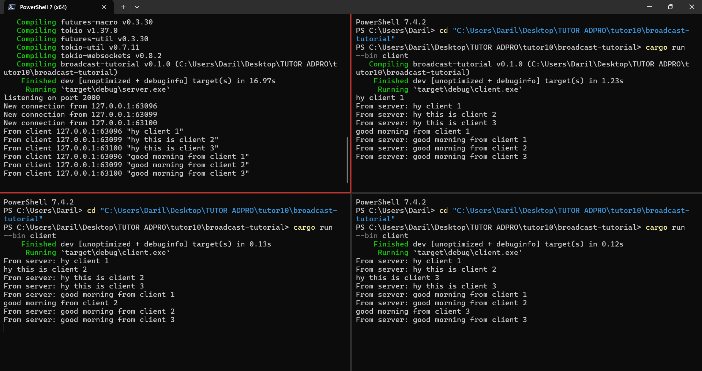

<h1> Original code of broadcast chat </h1>

> The client and server is connected through a websocket. The server will listen to the port that connects to a websocket then also connected to each client. When a message was sent from client, then the server will forwards it to all other clients available. Thus why, when I sent a message from one client, the other client will also get that message from the server.

<h1> Modifying the websocket port </h1>

> When we change one of the port of either client or server, the other side will also need to be on the same port so it could listen to each other.
